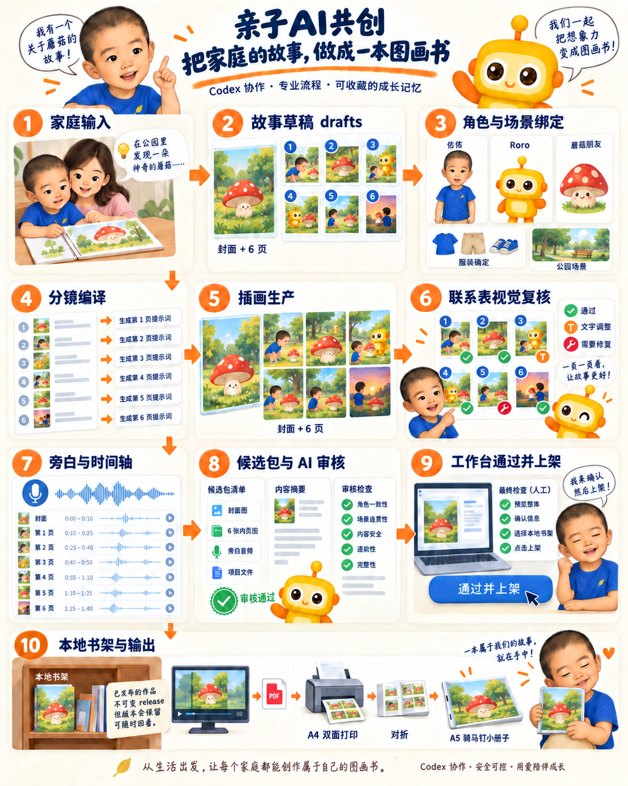
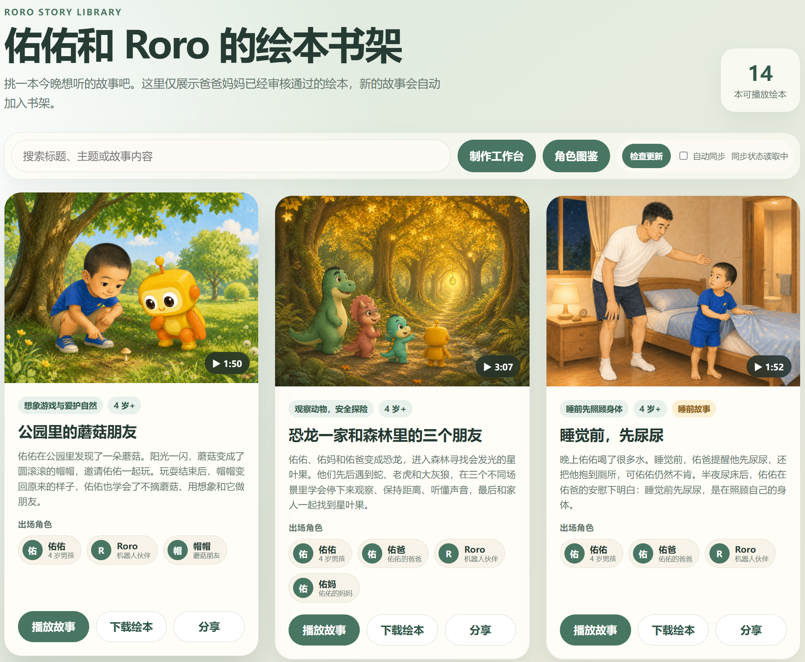

# Roro Story Studio

Roro Story Studio 是一个本地优先的家庭绘本创作、审核和播放工作区。它把故事草稿、角色连续性、插图、旁白、家长审核和局域网书架组织在同一个可追踪流程中。

当前源码、文档、测试、CI 与 Git 历史均已完成公开发布前整理。代码、脚本、配置、Schema 与技术文档采用 [Apache-2.0](LICENSE)；家庭内容保持在本地忽略目录，仓库只包含可再分发的模板、流程和技术实现。远程仓库的私有/公开切换与 Release 创建由维护者在托管平台执行；内容边界见 [许可证说明](LICENSE-STATUS.md)。

## 核心能力

- 封面加 6 页正文的儿童绘本结构、分镜和旁白模板。
- 草稿、本地已发布内容与导出物严格分区，记录开发确认与家长身份验证的区别。
- 已发布绘本可携带多种旁白音轨；播放器和制作工作台会在存在多个声音时显示切换器。
- 角色注册表和跨故事视觉连续性管理。
- 标准库 HTTP 服务提供本地书架、角色图鉴、审片工作台和有声播放器，缩略图与 PDF 使用 Pillow、ReportLab。
- 工作台提供“备选故事库 → 制作进度 → 最终审核 → 已上架”四段式入口；备选库只收录已有完整 6 页正文的故事。
- 本地音频播放与按各音色独立逐页时间轴自动翻页；手动跳页和切换音色也保持音画对应。
- 工作台可按当前候选版本导出带排版文字层的 4:3 PDF；PDF 与图片母版分离保存。
- Windows 一键启动、状态检查、停止和局域网防火墙配置。

## 绘本制作技术路线

以一个原创示例故事为例，平台把一次绘本制作拆成可追踪的生产阶段，而不是把“生成一张图片”当成完成：



核心流程是：

```text
家庭输入
→ drafts 故事草稿
→ 角色、服装与场景锚点绑定
→ 封面 + 6 页正文分镜编译
→ 插画生成与整本联系表视觉复核
→ 封面标题、逐页旁白与时间轴
→ 候选清单、包摘要与 ai-review
→ 工作台“通过并上架”
→ 本地书架、播放器与 PDF
→ A4 双面打印、对折、骑马钉成 A5 小册子
```

其中，草稿、内部审核、工作台确认和本地书架发布是分开的状态。只有明确的工作台确认，才会把准确候选写入本地不可变 release；历史版本保留，PDF 和实体打印属于后续输出层。插画母版保持全画幅无文字，正文由播放器或 PDF 排版层叠加。上架书架的界面示例可参见 [Roro Story Studio](https://roro.iepose.cn)。



## 隐私优先

本仓库默认不会追踪以下本地内容：

- 儿童真实照片、录音和家庭档案；
- `inbox/`、`drafts/`、`approved/` 中的家庭故事与审核记录；
- 生成的 PNG、WAV、PDF 和导出包；
- 本地角色目录、制作时间和运行日志。

提交前请运行 `git status --ignored` 与敏感信息检查；发布前复核见 [开源检查清单](docs/open-source-readiness.md)。

## 快速开始

环境要求：Windows 10/11、PowerShell 7（Windows PowerShell 5.1 也可）和 Python 3.10+。

```powershell
git clone <your-repository-url>
Set-Location roro-story-studio
Copy-Item .env.example .env
.\scripts\bootstrap-local-workspace.ps1
.\service\start-story-service.ps1
```

若使用本地 Docker，可先停止本机 Python 服务，再运行：

```powershell
docker compose --env-file .env -f deploy/local/compose.yaml up -d --build
```

详见 [本地 Docker 部署](deploy/local/README.md)。

本机入口：

- 绘本书架：`http://127.0.0.1:8877/`
- 制作工作台：`http://127.0.0.1:8877/workbench`
- 角色图鉴：`http://127.0.0.1:8877/characters`
- 健康检查：`http://127.0.0.1:8877/health`

局域网与防火墙配置见 [局域网服务说明](docs/lan-story-service.md)。

默认 `.env.example` 仅将服务绑定到 `127.0.0.1`。如需供可信局域网设备访问，在本地 `.env` 中将 `RORO_LISTEN_ADDRESS` 改为本机实际的局域网地址，并运行 `service/enable-lan-firewall.ps1`；不要使用公网端口转发。

## 创作与审核流程

1. 家长素材只进入本地 `inbox/`。
2. 新故事先在 `drafts/<story-id>/story.json` 形成完整 6 页正文；只有完整故事才进入工作台的备选故事库。
3. 家长从备选故事库挑选故事并保存制作清单，再进入插图、旁白和候选包制作。
4. 使用 `/workbench` 的制作进度和最终审核入口查看文字、画面和音频结果。
5. 文件存在或自动检查通过不等于工作台已确认。
6. 当前开发模式不要求家长 PIN；只有准确候选的“通过并上架”被持久化记录后，才能复制对应内容到本地 `approved/`。
7. 外部导出和 Roro 正式内容库仍需单独明确请求；主线稳定后可切回 PIN 保护模式。
8. 导出 PDF、音频、播放器或外部内容包需要单独授权。

故事任务由根目录 `AGENTS.md` 路由到 `skills/youyou-roro-story/SKILL.md`。

## 项目结构

| 路径 | 用途 | 默认进入 Git |
|---|---|---|
| `service/` | 本地 HTTP 服务、UI、脚本和公开示例 | 是，媒体和本地数据除外 |
| `skills/` | Codex 绘本工作流 | 是 |
| `templates/` | JSON Schema 与审核模板 | 是 |
| `universe/` | 通用故事世界和视觉规范 | 是，私人角色表除外 |
| `profile/` | 本地家庭档案与公开示例 | 仅 `*.example.md` |
| `inbox/` | 私人输入和照片 | 否 |
| `drafts/` | 未批准作品 | 否 |
| `approved/` | 本地不可变发布版本及其确认记录 | 否 |
| `exports/`、`output/` | 生成交付物 | 否 |
| `docs/` | 架构、局域网和开源维护文档 | 是 |

## 文档

- [制作管线与操作入口](docs/PRODUCTION_PIPELINE.md)：阶段、文件职责、单本命令和返修恢复点
- [制作经验与复用规则](docs/PRODUCTION_LESSONS.md)：图文收敛、视觉连续性、音频同步与证据边界
- [代码审核与维护经验](docs/MAINTENANCE_LESSONS.md)：按需加载、会话校验、缓存并发、回归与安全提交
- [绘本质量规范](docs/PICTURE_BOOK_WORKFLOW.md)
- [工作台状态与操作](docs/WORKBENCH_WORKFLOW.md)
- [项目架构](docs/architecture.md)
- [局域网绘本服务](docs/lan-story-service.md)
- [NAS 单机部署 MVP](docs/NAS_DEPLOYMENT_MVP.md)
- [贡献指南](CONTRIBUTING.md)
- [安全策略](SECURITY.md)
- [开源检查清单](docs/open-source-readiness.md)
- [维护交接](docs/HANDOFF.md)

## 许可证状态

代码和技术文档的默认许可证为 Apache-2.0。家庭故事、角色资料、插图、音频和第三方素材不自动适用该许可证；本仓库仅保留 README 中明确列出的公开示例图。详见 [许可证状态](LICENSE-STATUS.md)。
